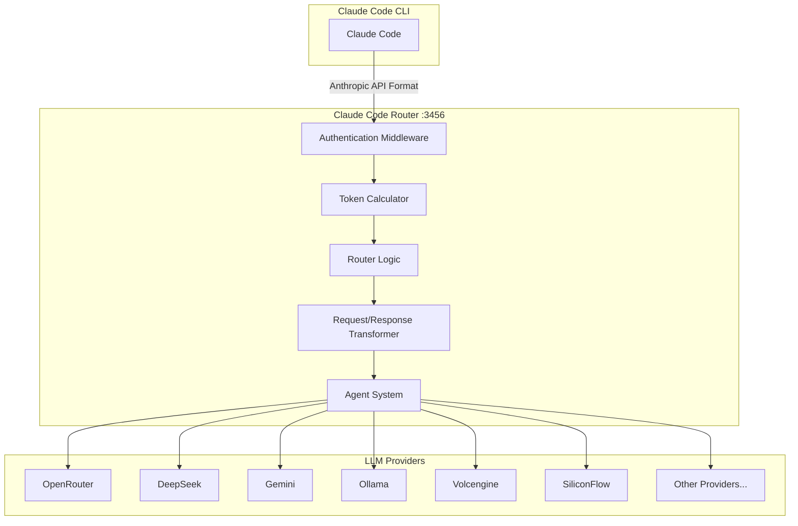
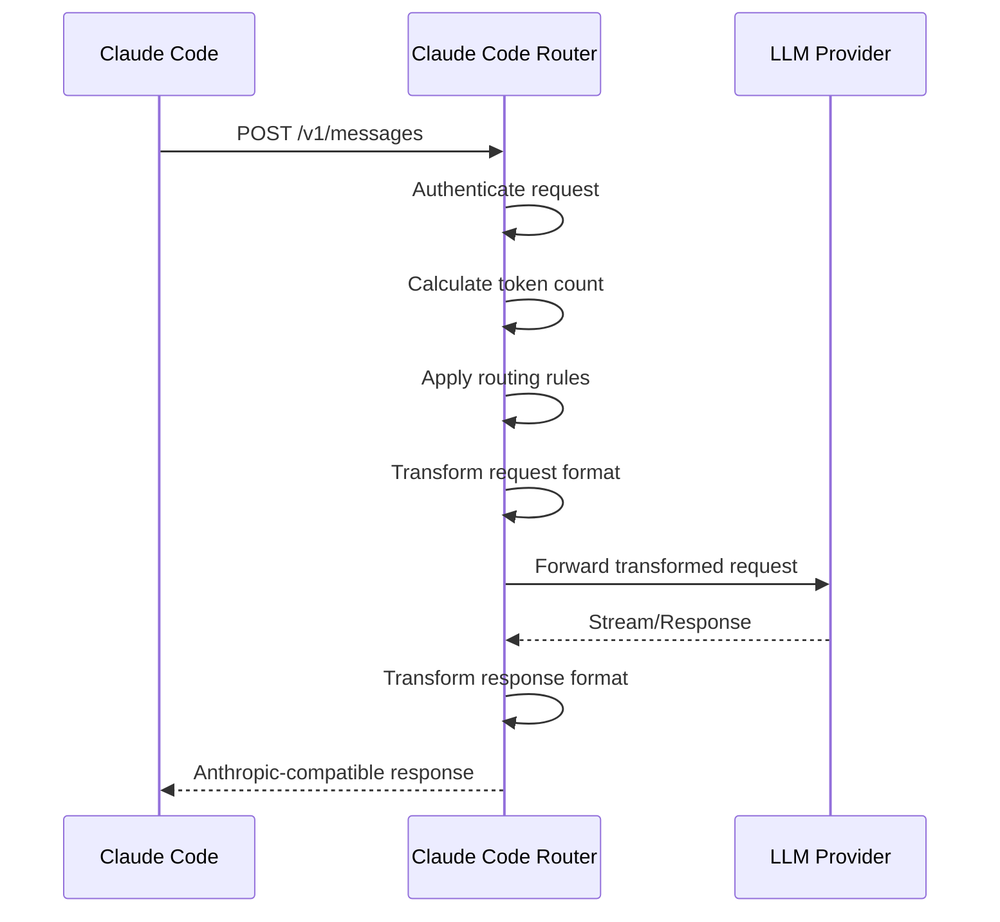
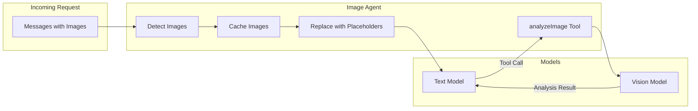

# Claude Code Router


[](README_zh.md)
[](https://discord.gg/rdftVMaUcS)
[](https://github.com/musistudio/claude-code-router/blob/main/LICENSE)
[](https://www.npmjs.com/package/@musistudio/claude-code-router)

---


> This project is sponsored by Z.ai, supporting us with their GLM CODING PLAN.
> GLM CODING PLAN is a subscription service designed for AI coding, starting at just $3/month. It provides access to their flagship GLM-4.7 model across 10+ popular AI coding tools (Claude Code, Cline, Roo Code, etc.), offering developers top-tier, fast, and stable coding experiences.
> Get 10% OFF GLM CODING PLAN: https://z.ai/subscribe?ic=8JVLJQFSKB

---

> A powerful routing proxy that enables Claude Code to work with any LLM provider. Route requests dynamically based on context, token count, task type, and custom logic.


## Table of Contents

- [Overview](#overview)
- [Architecture](#architecture)
- [Features](#features)
- [Installation](#installation)
- [Configuration](#configuration)
- [CLI Commands](#cli-commands)
- [Routing System](#routing-system)
- [Transformers](#transformers)
- [Agent System](#agent-system)
- [Web UI](#web-ui)
- [GitHub Actions Integration](#github-actions-integration)
- [Advanced Features](#advanced-features)
- [Troubleshooting](#troubleshooting)
- [Further Reading](#further-reading)
- [Support & Sponsoring](#support--sponsoring)

## Overview

Claude Code Router is a TypeScript-based proxy server that intercepts requests from Claude Code and routes them to different LLM providers based on configurable rules. This enables:

- **Cost Optimization**: Use cheaper models for background tasks, premium models for complex reasoning
- **Provider Flexibility**: Switch between OpenRouter, DeepSeek, Gemini, Ollama, and many more
- **Context-Aware Routing**: Automatically select models based on token count, task type, or custom logic
- **Seamless Integration**: Works transparently with Claude Code without any modifications

## Architecture



### Request Flow



## Features

### Core Features

| Feature                             | Description                                                                         |
| ----------------------------------- | ----------------------------------------------------------------------------------- |
| **Model Routing**                   | Route requests to different models based on task type, token count, or custom rules |
| **Multi-Provider Support**          | OpenRouter, DeepSeek, Ollama, Gemini, Volcengine, SiliconFlow, and more             |
| **Request/Response Transformation** | Automatic format conversion between Anthropic and provider-specific APIs            |
| **Dynamic Model Switching**         | Switch models on-the-fly using `/model` command in Claude Code                      |
| **CLI Model Management**            | Interactive terminal-based model configuration with `ccr model`                     |
| **Web UI**                          | Browser-based configuration interface                                               |
| **Status Line**                     | Real-time status display integration                                                |
| **Trace Mode**                      | Detailed request/response logging for debugging                                     |
| **Replay System**                   | Save and replay failed requests for debugging                                       |
| **Agent System**                    | Built-in agents for specialized tasks (e.g., image analysis)                        |
| **GitHub Actions**                  | CI/CD integration for automated workflows                                           |

### Routing Scenarios

| Route Type    | Use Case                          | Example Model                              |
| ------------- | --------------------------------- | ------------------------------------------ |
| `default`     | General tasks                     | `deepseek,deepseek-chat`                   |
| `background`  | Background/haiku tasks            | `ollama,qwen2.5-coder:latest`              |
| `think`       | Reasoning-heavy tasks (Plan Mode) | `deepseek,deepseek-reasoner`               |
| `longContext` | Large context (>60K tokens)       | `openrouter,google/gemini-2.5-pro-preview` |
| `webSearch`   | Web search enabled tasks          | `gemini,gemini-2.5-flash`                  |
| `image`       | Image analysis tasks              | `openrouter,anthropic/claude-sonnet-4`     |

## Installation

### Prerequisites

- Node.js 18+ or Bun
- [Claude Code](https://docs.anthropic.com/en/docs/claude-code/quickstart) installed

### Install Claude Code

```shell
npm install -g @anthropic-ai/claude-code
```

### Install Claude Code Router

```shell
# Using npm
npm install -g @musistudio/claude-code-router

# Using pnpm
pnpm add -g @musistudio/claude-code-router

# Using bun
bun add -g @musistudio/claude-code-router
```

### Verify Installation

```shell
ccr --version
```

## Configuration

### Configuration File Location

Configuration is stored at `~/.claude-code-router/config.json`. For more details, refer to `config.example.json`.

### Configuration Schema

```json
{
  "PORT": 3456,
  "HOST": "127.0.0.1",
  "APIKEY": "your-secret-key",
  "PROXY_URL": "http://127.0.0.1:7890",
  "LOG": true,
  "LOG_LEVEL": "debug",
  "API_TIMEOUT_MS": 600000,
  "NON_INTERACTIVE_MODE": false,
  "TRACE_MODE": false,
  "TRACE_INCLUDE_BODIES": false,
  "CUSTOM_ROUTER_PATH": "/path/to/custom-router.js",
  "REWRITE_SYSTEM_PROMPT": "/path/to/system-prompt.txt",
  "forceUseImageAgent": false,
  "Providers": [],
  "Router": {},
  "transformers": []
}
```

### Configuration Options

| Option                  | Type    | Default     | Description                                                                                                                                                  |
| ----------------------- | ------- | ----------- | ------------------------------------------------------------------------------------------------------------------------------------------------------------ |
| `PORT`                  | number  | `3456`      | Server port                                                                                                                                                  |
| `HOST`                  | string  | `127.0.0.1` | Server host (forced to 127.0.0.1 if APIKEY not set)                                                                                                          |
| `APIKEY`                | string  | -           | API key for authentication. When set, clients must provide this key in the `Authorization` header (e.g., `Bearer your-secret-key`) or the `x-api-key` header |
| `PROXY_URL`             | string  | -           | HTTP proxy for API requests                                                                                                                                  |
| `LOG`                   | boolean | `true`      | Enable logging. When set to `false`, no log files will be created                                                                                            |
| `LOG_LEVEL`             | string  | `debug`     | Log level: `fatal`, `error`, `warn`, `info`, `debug`, `trace`                                                                                                |
| `API_TIMEOUT_MS`        | number  | `600000`    | API call timeout in milliseconds                                                                                                                             |
| `NON_INTERACTIVE_MODE`  | boolean | `false`     | Enable for CI/CD environments. Sets `CI=true`, `FORCE_COLOR=0`, etc.                                                                                         |
| `TRACE_MODE`            | boolean | `false`     | Enable detailed request tracing                                                                                                                              |
| `TRACE_INCLUDE_BODIES`  | boolean | `false`     | Include request/response bodies in traces                                                                                                                    |
| `CUSTOM_ROUTER_PATH`    | string  | -           | Path to custom router JavaScript file                                                                                                                        |
| `REWRITE_SYSTEM_PROMPT` | string  | -           | Path to custom system prompt file                                                                                                                            |
| `forceUseImageAgent`    | boolean | `false`     | Force image agent for non-tool-calling models                                                                                                                |

### Logging System

Claude Code Router uses two separate logging systems:

| Log Type          | Location                                       | Content                                        |
| ----------------- | ---------------------------------------------- | ---------------------------------------------- |
| Server-level      | `~/.claude-code-router/logs/ccr-*.log`         | HTTP requests, API calls, server events (pino) |
| Application-level | `~/.claude-code-router/claude-code-router.log` | Routing decisions, business logic              |

### Environment Variable Interpolation

Reference environment variables in config using `$VAR_NAME` or `${VAR_NAME}`:

```json
{
  "OPENAI_API_KEY": "$OPENAI_API_KEY",
  "GEMINI_API_KEY": "${GEMINI_API_KEY}",
  "Providers": [
    {
      "name": "openai",
      "api_base_url": "https://api.openai.com/v1/chat/completions",
      "api_key": "$OPENAI_API_KEY",
      "models": ["gpt-5", "gpt-5-mini"]
    }
  ]
}
```

This allows you to keep sensitive API keys in environment variables instead of hardcoding them in configuration files. The interpolation works recursively through nested objects and arrays.

### Provider Configuration

The `Providers` array defines the different model providers you want to use. Each provider object requires:

- `name`: A unique name for the provider
- `api_base_url`: The full API endpoint for chat completions
- `api_key`: Your API key for the provider
- `models`: A list of model names available from this provider
- `transformer` (optional): Specifies transformers to process requests and responses

**Example Configuration:**

```json
{
  "Providers": [
    {
      "name": "openrouter",
      "api_base_url": "https://openrouter.ai/api/v1/chat/completions",
      "api_key": "sk-xxx",
      "models": [
        "google/gemini-2.5-pro-preview",
        "anthropic/claude-sonnet-4",
        "anthropic/claude-3.5-sonnet",
        "anthropic/claude-3.7-sonnet:thinking"
      ],
      "transformer": {
        "use": ["openrouter"]
      }
    },
    {
      "name": "deepseek",
      "api_base_url": "https://api.deepseek.com/chat/completions",
      "api_key": "sk-xxx",
      "models": ["deepseek-chat", "deepseek-reasoner"],
      "transformer": {
        "use": ["deepseek"],
        "deepseek-chat": {
          "use": ["tooluse"]
        }
      }
    },
    {
      "name": "ollama",
      "api_base_url": "http://localhost:11434/v1/chat/completions",
      "api_key": "ollama",
      "models": ["qwen2.5-coder:latest"]
    },
    {
      "name": "gemini",
      "api_base_url": "https://generativelanguage.googleapis.com/v1beta/models/",
      "api_key": "sk-xxx",
      "models": ["gemini-2.5-flash", "gemini-2.5-pro"],
      "transformer": {
        "use": ["gemini"]
      }
    },
    {
      "name": "volcengine",
      "api_base_url": "https://ark.cn-beijing.volces.com/api/v3/chat/completions",
      "api_key": "sk-xxx",
      "models": ["deepseek-v3-250324", "deepseek-r1-250528"],
      "transformer": {
        "use": ["deepseek"]
      }
    }
  ]
}
```

### Router Configuration

The `Router` object defines which model to use for different scenarios:

```json
{
  "Router": {
    "default": "deepseek,deepseek-chat",
    "background": "ollama,qwen2.5-coder:latest",
    "think": "deepseek,deepseek-reasoner",
    "longContext": "openrouter,google/gemini-2.5-pro-preview",
    "longContextThreshold": 60000,
    "webSearch": "gemini,gemini-2.5-flash",
    "image": "openrouter,anthropic/claude-sonnet-4"
  }
}
```

| Route                  | Description                                                                              |
| ---------------------- | ---------------------------------------------------------------------------------------- |
| `default`              | Default model for general tasks                                                          |
| `background`           | Model for background tasks (can be smaller/local to save costs)                          |
| `think`                | Model for reasoning-heavy tasks like Plan Mode                                           |
| `longContext`          | Model for handling long contexts (e.g., >60K tokens)                                     |
| `longContextThreshold` | Token count threshold for triggering long context model (default: 60000)                 |
| `webSearch`            | Model for web search tasks (requires model support; add `:online` suffix for OpenRouter) |
| `image`                | Model for image-related tasks (beta, uses built-in agent)                                |

## CLI Commands

### Command Reference

```
Usage: ccr [command]

Commands:
  start         Start the router server
  stop          Stop the router server
  restart       Restart the router server
  status        Show server status
  statusline    Integrated statusline (for shell integration)
  code          Execute claude command through router
  model         Interactive model selection and configuration
  activate      Output environment variables for shell integration
  ui            Open the web UI in browser
  replay        Manage request replays (list, run, clear)
  -v, version   Show version information
  -h, help      Show help information
```

### Starting the Router

```shell
# Start the server
ccr start

# Run Claude Code through the router
ccr code

# Run with a specific prompt
ccr code "Write a Hello World in Python"
```

> **Note**: After modifying the configuration file, restart the service:
>
> ```shell
> ccr restart
> ```

### Model Management

```shell
# Interactive model selector
ccr model
```


The interactive CLI allows you to:

- View current configuration
- See all configured models (default, background, think, longContext, webSearch, image)
- Switch models for each router type
- Add new models to existing providers
- Create new provider configurations with transformer support

### Environment Activation

```shell
# Set environment variables for current shell
eval "$(ccr activate)"

# Now use claude directly
claude "Your prompt here"
```

The `activate` command sets:

- `ANTHROPIC_AUTH_TOKEN`: API key from configuration
- `ANTHROPIC_BASE_URL`: Router endpoint (default: `http://127.0.0.1:3456`)
- `NO_PROXY`: Set to `127.0.0.1`
- `DISABLE_TELEMETRY`: Disables telemetry
- `DISABLE_COST_WARNINGS`: Disables cost warnings
- `API_TIMEOUT_MS`: API timeout from configuration

> **Note**: Make sure the Claude Code Router service is running (`ccr start`) before using the activated environment variables. To make them persistent, add `eval "$(ccr activate)"` to your shell configuration file (e.g., `~/.zshrc` or `~/.bashrc`).

### Web UI

```shell
ccr ui
```


This opens a web-based interface where you can easily view and edit your configuration.

### Replay System

```shell
# List saved replays
ccr replay list

# Run the latest replay
ccr replay run latest

# Run a specific replay by ID
ccr replay run <replay-id>

# Clear all replays
ccr replay clear
```

Replays are automatically saved when errors occur, enabling debugging of failed requests.

## Routing System

### Automatic Routing

The router automatically selects models based on:

1. **Token Count**: If tokens exceed `longContextThreshold`, use `longContext` model
2. **Model Type**: Claude Haiku variants use `background` model
3. **Web Search**: Requests with web search tools use `webSearch` model
4. **Thinking Mode**: Requests with thinking enabled use `think` model
5. **Subagent Routing**: Special tags in prompts for subagent model selection

### Manual Model Switching

In Claude Code, use the `/model` command:

```
/model provider_name,model_name
```

Example:

```
/model openrouter,anthropic/claude-3.5-sonnet
```

### Subagent Routing

Specify models for subagents by including a tag at the **beginning** of the prompt:

```
<CCR-SUBAGENT-MODEL>openrouter,anthropic/claude-3.5-sonnet</CCR-SUBAGENT-MODEL>
Please help me analyze this code snippet for potential optimizations...
```

### Custom Router

For advanced routing logic, create a custom router:

**config.json:**

```json
{
  "CUSTOM_ROUTER_PATH": "/path/to/custom-router.js"
}
```

**custom-router.js:**

```javascript
/**
 * Custom router function
 * @param {object} req - Request object with body, headers, tokenCount
 * @param {object} config - Application config
 * @param {object} context - Context with event emitter
 * @returns {Promise<string|null>} - "provider,model" or null for default routing
 */
module.exports = async function router(req, config, context) {
  const userMessage = req.body.messages.find((m) => m.role === "user")?.content;

  // Route code explanation requests to a specific model
  if (userMessage && userMessage.includes("explain this code")) {
    return "openrouter,anthropic/claude-3.5-sonnet";
  }

  // Route based on token count
  if (req.tokenCount > 100000) {
    return "openrouter,google/gemini-2.5-pro-preview";
  }

  // Return null to use default routing
  return null;
};
```

### Project-Specific Configuration

Create project-specific routing by placing configuration files in:

- `~/.claude-code-router/<project>/config.json` - Project-level config
- `~/.claude-code-router/<project>/<session-id>.json` - Session-level config

## Transformers

Transformers adapt request/response formats for different provider APIs.

### Transformer Configuration

**Global Transformer** - Apply to all models from a provider:

```json
{
  "transformer": { "use": ["openrouter"] }
}
```

**Model-Specific Transformer** - Apply to specific models:

```json
{
  "transformer": {
    "use": ["deepseek"],
    "deepseek-chat": { "use": ["tooluse"] }
  }
}
```

**Transformer with Options** - Pass configuration to transformers:

```json
{
  "transformer": {
    "use": [["maxtoken", { "max_tokens": 16384 }]]
  }
}
```

**OpenRouter Provider Routing:**

```json
{
  "transformer": {
    "use": ["openrouter"],
    "moonshotai/kimi-k2": {
      "use": [
        [
          "openrouter",
          {
            "provider": {
              "only": ["moonshotai/fp8"]
            }
          }
        ]
      ]
    }
  }
}
```

### Built-in Transformers

| Transformer     | Description                                                                                                     |
| --------------- | --------------------------------------------------------------------------------------------------------------- |
| `Anthropic`     | Preserves original Anthropic format (direct passthrough)                                                        |
| `deepseek`      | Adapts for DeepSeek API                                                                                         |
| `gemini`        | Adapts for Gemini API                                                                                           |
| `openrouter`    | Adapts for OpenRouter API with [provider routing](https://openrouter.ai/docs/features/provider-routing) support |
| `groq`          | Adapts for Groq API                                                                                             |
| `maxtoken`      | Sets specific `max_tokens` value                                                                                |
| `tooluse`       | Optimizes tool usage via `tool_choice`                                                                          |
| `reasoning`     | Processes `reasoning_content` field                                                                             |
| `sampling`      | Processes sampling parameters (temperature, top_p, top_k, repetition_penalty)                                   |
| `enhancetool`   | Adds error tolerance to tool call parameters (disables streaming for tool calls)                                |
| `cleancache`    | Clears `cache_control` field from requests                                                                      |
| `vertex-gemini` | Handles Gemini API with Vertex authentication                                                                   |

### Experimental Transformers

| Transformer  | Description                                 | Link                                                                                            |
| ------------ | ------------------------------------------- | ----------------------------------------------------------------------------------------------- |
| `gemini-cli` | Unofficial Gemini via Gemini CLI            | [gemini-cli.js](https://gist.github.com/musistudio/1c13a65f35916a7ab690649d3df8d1cd)            |
| `qwen-cli`   | Unofficial Qwen3-coder-plus via Qwen CLI    | [qwen-cli.js](https://gist.github.com/musistudio/f5a67841ced39912fd99e42200d5ca8b)              |
| `rovo-cli`   | Unofficial GPT-5 via Atlassian Rovo Dev CLI | [rovo-cli.js](https://gist.github.com/SaseQ/c2a20a38b11276537ec5332d1f7a5e53)                   |
| `chutes-glm` | Unofficial GLM 4.5 via Chutes               | [chutes-glm-transformer.js](https://gist.github.com/vitobotta/2be3f33722e05e8d4f9d2b0138b8c863) |

### Custom Transformers

Create custom transformers and load them via config:

```json
{
  "transformers": [
    {
      "path": "/path/to/custom-transformer.js",
      "options": {
        "project": "xxx"
      }
    }
  ]
}
```

## Agent System

The agent system provides specialized handling for specific task types.

### Image Agent

The Image Agent enables image analysis for models that don't natively support vision:



**How it works:**

1. Detects image content in messages
2. Caches images with unique IDs
3. Replaces images with text placeholders
4. Provides an `analyzeImage` tool for on-demand analysis
5. Routes image analysis to a vision-capable model

**Configuration:**

```json
{
  "Router": {
    "image": "openrouter,anthropic/claude-sonnet-4"
  },
  "forceUseImageAgent": false
}
```

Set `forceUseImageAgent: true` if the image model doesn't support tool calling.

## Status Line (Beta)

Enable the integrated status line for real-time model and usage information:


## GitHub Actions Integration

Integrate Claude Code Router into your CI/CD pipeline:

```yaml
name: Claude Code

on:
  issue_comment:
    types: [created]

jobs:
  claude:
    if: contains(github.event.comment.body, '@claude')
    runs-on: ubuntu-latest
    permissions:
      contents: read
      pull-requests: read
      issues: read
      id-token: write
    steps:
      - name: Checkout repository
        uses: actions/checkout@v4
        with:
          fetch-depth: 1

      - name: Prepare Environment
        run: |
          curl -fsSL https://bun.sh/install | bash
          mkdir -p $HOME/.claude-code-router
          cat << 'EOF' > $HOME/.claude-code-router/config.json
          {
            "LOG": true,
            "NON_INTERACTIVE_MODE": true,
            "OPENAI_API_KEY": "${{ secrets.OPENAI_API_KEY }}",
            "OPENAI_BASE_URL": "https://api.deepseek.com",
            "OPENAI_MODEL": "deepseek-chat"
          }
          EOF
        shell: bash

      - name: Start Claude Code Router
        run: |
          nohup ~/.bun/bin/bunx @musistudio/claude-code-router@latest start &
        shell: bash

      - name: Run Claude Code
        id: claude
        uses: anthropics/claude-code-action@beta
        env:
          ANTHROPIC_BASE_URL: http://localhost:3456
        with:
          anthropic_api_key: "any-string-is-ok"
```

> **Important:** Set `NON_INTERACTIVE_MODE: true` for CI/CD environments to prevent stdin handling issues.

## Advanced Features

### Trace Mode

Enable detailed request tracing for debugging:

```json
{
  "TRACE_MODE": true,
  "TRACE_INCLUDE_BODIES": true
}
```

Trace logs include:

- Incoming request details
- Router decisions
- Transformer output
- Provider responses
- Error information
- Agent tool executions

### Token Counting

The router provides a token counting endpoint:

```
POST /v1/messages/count_tokens
```

Uses tiktoken (cl100k_base encoding) for accurate token estimation.

### Session and Usage Tracking

The router tracks:

- Session IDs from metadata
- Token usage per session (cached in LRU cache)
- Request/response metrics

## Troubleshooting

### Common Issues

| Issue                 | Solution                                        |
| --------------------- | ----------------------------------------------- |
| Service won't start   | Check if port 3456 is in use: `lsof -i :3456`   |
| Authentication errors | Verify APIKEY in config matches request headers |
| Provider errors       | Check provider API key and endpoint URL         |
| Timeout errors        | Increase `API_TIMEOUT_MS` in config             |
| Streaming issues      | Ensure provider supports streaming              |

### Debug Commands

```shell
# Check service status
ccr status

# View server logs
tail -f ~/.claude-code-router/logs/ccr-*.log

# View application logs
tail -f ~/.claude-code-router/claude-code-router.log
```

## Further Reading

- [Project Motivation and How It Works](blog/en/project-motivation-and-how-it-works.md)
- [Maybe We Can Do More with the Router](blog/en/maybe-we-can-do-more-with-the-route.md)
- [GLM-4.6 Supports Reasoning and Interleaved Thinking](blog/en/glm-4.6-supports-reasoning.md)

## Support & Sponsoring

If you find this project helpful, please consider sponsoring its development. Your support is greatly appreciated!

[](https://ko-fi.com/F1F31GN2GM)

[Paypal](https://paypal.me/musistudio1999)

<table>
  <tr>
    <td></td>
    <td></td>
  </tr>
</table>

### Our Sponsors

A huge thank you to all our sponsors for their generous support!

- [AIHubmix](https://aihubmix.com/)
- [BurnCloud](https://ai.burncloud.com)
- [302.AI](https://share.302.ai/ZGVF9w)
- [Z智谱](https://www.bigmodel.cn/claude-code?ic=FPF9IVAGFJ)
- @Simon Leischnig
- [@duanshuaimin](https://github.com/duanshuaimin)
- [@vrgitadmin](https://github.com/vrgitadmin)
- And many more...

(If your name is masked, please contact me via my homepage email to update it with your GitHub username.)

---

## License

MIT License - see [LICENSE](LICENSE) for details.
