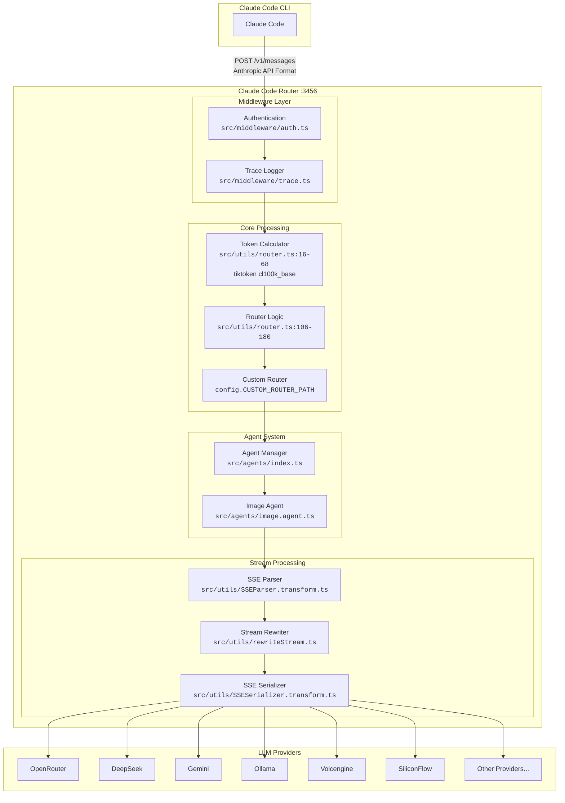
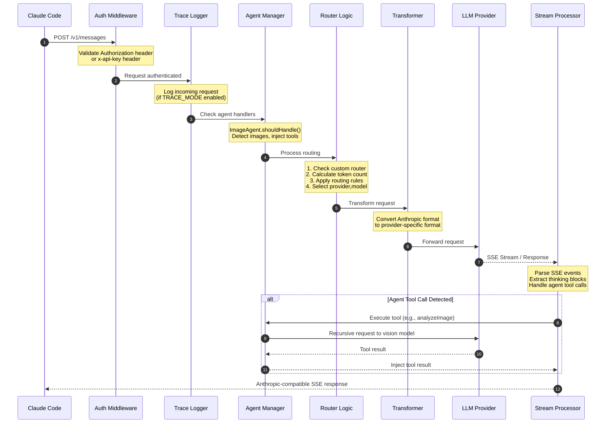
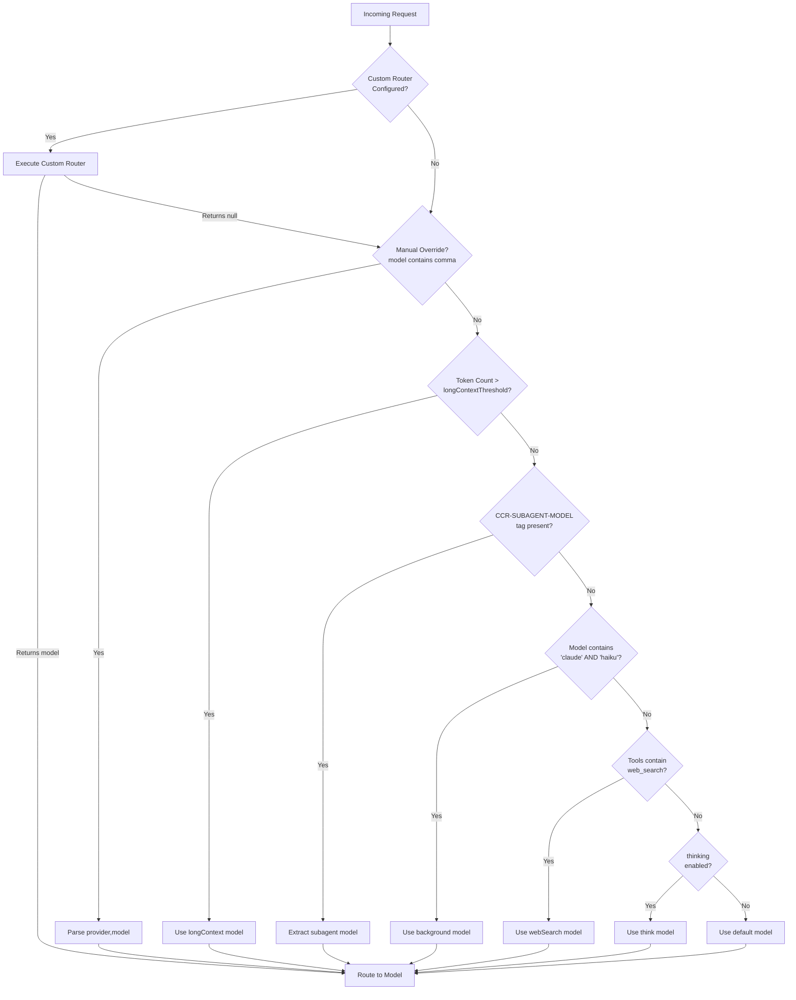
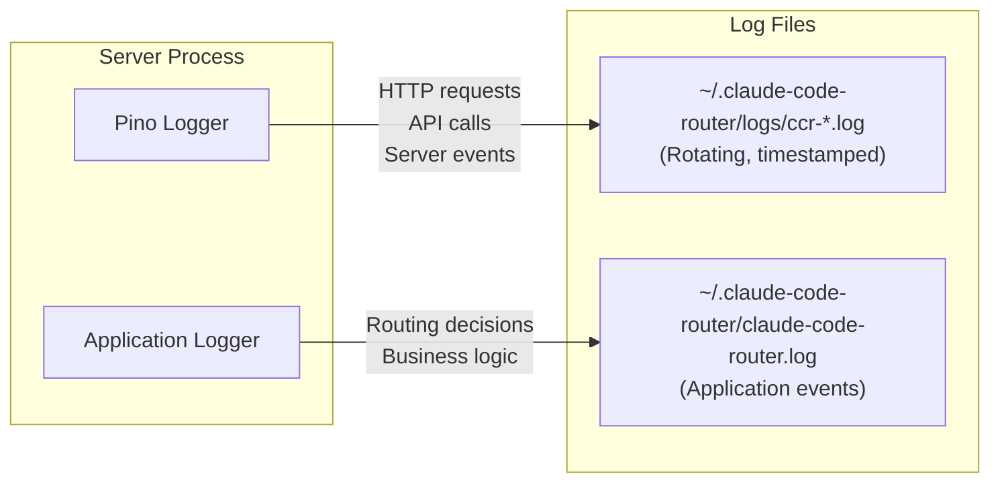
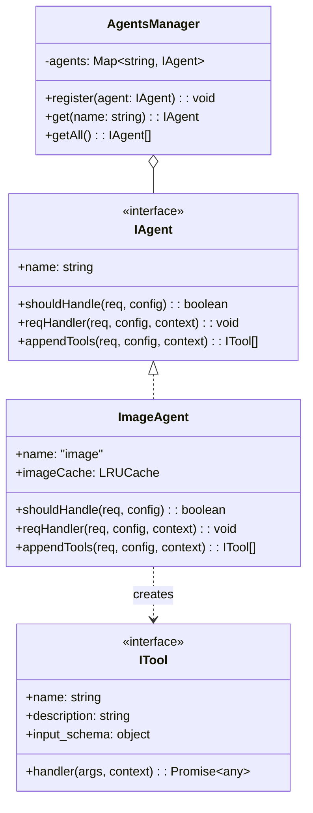

# Claude Code Router


[](README_zh.md)
[](https://discord.gg/rdftVMaUcS)
[](https://github.com/musistudio/claude-code-router/blob/main/LICENSE)
[](https://www.npmjs.com/package/@musistudio/claude-code-router)

---

> A powerful routing proxy that enables Claude Code to work with any LLM provider. Route requests dynamically based on context, token count, task type, and custom logic.


## Table of Contents

- [Overview](#overview)
- [Technical Architecture](#technical-architecture)
- [Core Features](#core-features)
- [Installation](#installation)
- [Configuration Reference](#configuration-reference)
- [CLI Command Reference](#cli-command-reference)
- [Routing System Deep Dive](#routing-system-deep-dive)
- [Transformer System](#transformer-system)
- [Agent System](#agent-system)
- [Advanced Features](#advanced-features)
- [Troubleshooting](#troubleshooting)
- [Further Reading](#further-reading)
- [Support & Sponsoring](#support--sponsoring)

---

## Overview

Claude Code Router is a TypeScript-based proxy server built on [Fastify](https://fastify.io/) (via the `@musistudio/llms` library) that intercepts requests from Claude Code and routes them to different LLM providers based on configurable rules. The router operates as a transparent middleware layer, accepting Anthropic API format requests and transforming them for various upstream providers.

### Key Capabilities

| Capability                | Description                                                                                        | Implementation                                             |
| ------------------------- | -------------------------------------------------------------------------------------------------- | ---------------------------------------------------------- |
| **Cost Optimization**     | Route background/simple tasks to cheaper models, reserve premium models for complex reasoning      | Automatic haiku detection routes to `background` model     |
| **Provider Flexibility**  | Switch between OpenRouter, DeepSeek, Gemini, Ollama, Volcengine, SiliconFlow, and custom providers | Provider configuration in `config.json`                    |
| **Context-Aware Routing** | Automatically select models based on token count, task type, or custom logic                       | Token counting via `tiktoken` with configurable thresholds |
| **Seamless Integration**  | Works transparently with Claude Code without any modifications                                     | Environment variable injection via `ccr activate`          |

---

## Technical Architecture

### System Component Diagram



### Detailed Request Flow



### File Structure Overview

```
src/
├── index.ts              # Server entry point, hook registration
├── cli.ts                # CLI command handler
├── server.ts             # Fastify server configuration
├── constants.ts          # Path constants (HOME_DIR, CONFIG_FILE, PID_FILE)
├── middleware/
│   ├── auth.ts           # API key authentication
│   └── trace.ts          # Request/response tracing
├── agents/
│   ├── index.ts          # AgentsManager class
│   ├── type.ts           # IAgent, ITool interfaces
│   └── image.agent.ts    # Image analysis agent
└── utils/
    ├── router.ts         # Core routing logic, token counting
    ├── modelSelector.ts  # Interactive model configuration
    ├── SSEParser.transform.ts    # SSE stream parser
    ├── SSESerializer.transform.ts # SSE stream serializer
    ├── rewriteStream.ts  # Stream interception and rewriting
    ├── cache.ts          # LRU cache for session usage
    ├── replay.ts         # Failed request replay storage
    ├── statusline.ts     # Terminal status line rendering
    ├── activateCommand.ts # Environment variable generation
    ├── codeCommand.ts    # Claude CLI execution wrapper
    └── createEnvVariables.ts # Environment variable builder
```

---

## Core Features

### Feature Implementation Matrix

| Feature                             | Status      | Primary Implementation             | Description                                                     |
| ----------------------------------- | ----------- | ---------------------------------- | --------------------------------------------------------------- |
| **Model Routing**                   | Implemented | `src/utils/router.ts:106-180`      | Routes requests based on task type, token count, custom rules   |
| **Multi-Provider Support**          | Implemented | `src/utils/modelSelector.ts:20-26` | OpenRouter, DeepSeek, Ollama, Gemini, Volcengine, SiliconFlow   |
| **Request/Response Transformation** | Implemented | `@musistudio/llms` dependency      | Automatic format conversion between Anthropic and provider APIs |
| **Dynamic Model Switching**         | Implemented | `src/utils/router.ts:115-127`      | `/model provider,model` command parsing                         |
| **CLI Model Management**            | Implemented | `src/utils/modelSelector.ts`       | Interactive TUI using `@inquirer/prompts`                       |
| **Web UI**                          | Implemented | `src/server.ts:65-74`              | Static file serving from `dist` directory                       |
| **Status Line**                     | Implemented | `src/utils/statusline.ts`          | Powerline-compatible terminal status                            |
| **Trace Mode**                      | Implemented | `src/middleware/trace.ts`          | Detailed request/response logging                               |
| **Replay System**                   | Implemented | `src/utils/replay.ts`              | Save and replay failed requests                                 |
| **Agent System**                    | Implemented | `src/agents/`                      | Extensible agent framework with ImageAgent                      |
| **GitHub Actions**                  | Supported   | `src/utils/codeCommand.ts:30-35`   | `NON_INTERACTIVE_MODE` for CI/CD                                |

### Routing Scenarios



| Route Type    | Trigger Condition                                      | Implementation Location            | Example Configuration                        |
| ------------- | ------------------------------------------------------ | ---------------------------------- | -------------------------------------------- |
| `default`     | No other conditions match                              | `src/utils/router.ts:179`          | `"deepseek,deepseek-chat"`                   |
| `background`  | Model name contains "claude" AND "haiku"               | `src/utils/router.ts:157-165`      | `"ollama,qwen2.5-coder:latest"`              |
| `think`       | `req.body.thinking` is truthy                          | `src/utils/router.ts:175-178`      | `"deepseek,deepseek-reasoner"`               |
| `longContext` | Token count > `longContextThreshold` (default: 60000)  | `src/utils/router.ts:129-141`      | `"openrouter,google/gemini-2.5-pro-preview"` |
| `webSearch`   | Tools array contains `type` starting with `web_search` | `src/utils/router.ts:167-172`      | `"gemini,gemini-2.5-flash"`                  |
| `image`       | Messages contain image content                         | `src/agents/image.agent.ts:58-101` | `"openrouter,anthropic/claude-sonnet-4"`     |

---

## Installation

### Prerequisites

- **Node.js 18+** (required by Fastify ^5.4.0 dependency) or **Bun**
- [Claude Code](https://docs.anthropic.com/en/docs/claude-code/quickstart) installed

### Install Claude Code

```shell
npm install -g @anthropic-ai/claude-code
```

### Install Claude Code Router

```shell
# Using npm
npm install -g @musistudio/claude-code-router

# Using pnpm
pnpm add -g @musistudio/claude-code-router

# Using bun
bun add -g @musistudio/claude-code-router
```

### Verify Installation

```shell
ccr --version
```

### Package Details

| Field               | Value                                       |
| ------------------- | ------------------------------------------- |
| Package Name        | `@musistudio/claude-code-router`            |
| Binary Command      | `ccr` (mapped to `dist/cli.js`)             |
| Node.js Requirement | >= 18.0.0 (implicit via Fastify dependency) |

---

## Configuration Reference

### Configuration File Location

Configuration is stored at `~/.claude-code-router/config.json` (defined in `src/constants.ts:6`).

```typescript
// src/constants.ts
export const HOME_DIR = path.join(os.homedir(), ".claude-code-router");
export const CONFIG_FILE = path.join(HOME_DIR, "config.json");
```

### Complete Configuration Schema

```json
{
  "PORT": 3456,
  "HOST": "127.0.0.1",
  "APIKEY": "your-secret-key",
  "PROXY_URL": "http://127.0.0.1:7890",
  "LOG": true,
  "LOG_LEVEL": "debug",
  "API_TIMEOUT_MS": 600000,
  "NON_INTERACTIVE_MODE": false,
  "TRACE_MODE": false,
  "TRACE_INCLUDE_BODIES": false,
  "CUSTOM_ROUTER_PATH": "/path/to/custom-router.js",
  "REWRITE_SYSTEM_PROMPT": "/path/to/system-prompt.txt",
  "forceUseImageAgent": false,
  "Providers": [],
  "Router": {},
  "transformers": []
}
```

### Configuration Options Reference

| Option                  | Type    | Default     | Source Location                      | Description                                                                  |
| ----------------------- | ------- | ----------- | ------------------------------------ | ---------------------------------------------------------------------------- |
| `PORT`                  | number  | `3456`      | `src/index.ts:79`                    | Server listening port                                                        |
| `HOST`                  | string  | `127.0.0.1` | `src/index.ts:72`                    | Server bind address (forced to 127.0.0.1 if APIKEY not set)                  |
| `APIKEY`                | string  | -           | `src/middleware/auth.ts:11`          | API key for authentication via `Authorization: Bearer` or `x-api-key` header |
| `PROXY_URL`             | string  | -           | -                                    | HTTP proxy for outbound API requests                                         |
| `LOG`                   | boolean | `true`      | `src/index.ts:117`                   | Enable/disable file logging                                                  |
| `LOG_LEVEL`             | string  | `debug`     | `src/index.ts:119`                   | Pino log level: `fatal`, `error`, `warn`, `info`, `debug`, `trace`           |
| `API_TIMEOUT_MS`        | number  | `600000`    | `src/utils/createEnvVariables.ts:19` | API call timeout in milliseconds (10 minutes default)                        |
| `NON_INTERACTIVE_MODE`  | boolean | `false`     | `src/utils/codeCommand.ts:30`        | CI/CD mode: sets `CI=true`, `TERM=dumb`, `FORCE_COLOR=0`                     |
| `TRACE_MODE`            | boolean | `false`     | `src/middleware/trace.ts:55`         | Enable detailed request tracing                                              |
| `TRACE_INCLUDE_BODIES`  | boolean | `false`     | `src/middleware/trace.ts:62`         | Include full request/response bodies in traces                               |
| `CUSTOM_ROUTER_PATH`    | string  | -           | `src/utils/router.ts:210`            | Path to custom router JavaScript module                                      |
| `REWRITE_SYSTEM_PROMPT` | string  | -           | `src/utils/router.ts:194`            | Path to custom system prompt file                                            |
| `forceUseImageAgent`    | boolean | `false`     | `src/agents/image.agent.ts:63`       | Force agent workflow for images (vs direct routing)                          |

### Logging System Architecture



| Log Type          | Location                                       | Content                                 | Implementation                                      |
| ----------------- | ---------------------------------------------- | --------------------------------------- | --------------------------------------------------- |
| Server-level      | `~/.claude-code-router/logs/ccr-*.log`         | HTTP requests, API calls, server events | Pino with rotating-file-stream (`src/index.ts:114`) |
| Application-level | `~/.claude-code-router/claude-code-router.log` | Routing decisions, business logic       | `src/index.ts:137-140`                              |

### Environment Variable Interpolation

The configuration system supports environment variable interpolation using `$VAR_NAME` or `${VAR_NAME}` syntax.

**Implementation:** `src/utils/index.ts:14-20`

```typescript
const interpolateEnvVars = (obj: any): any => {
  // ...
  return obj.replace(/\$\{([^}]+)\}|\$([A-Z_][A-Z0-9_]*)/g, (match, braced, unbraced) => {
    const varName = braced || unbraced;
    return process.env[varName] || match; // Keep original if env var doesn't exist
  });
};
```

**Example Configuration:**

```json
{
  "OPENAI_API_KEY": "$OPENAI_API_KEY",
  "GEMINI_API_KEY": "${GEMINI_API_KEY}",
  "Providers": [
    {
      "name": "openai",
      "api_base_url": "https://api.openai.com/v1/chat/completions",
      "api_key": "$OPENAI_API_KEY",
      "models": ["gpt-4o", "gpt-4o-mini"]
    }
  ]
}
```

### Provider Configuration

The `Providers` array defines LLM provider connections:

```json
{
  "Providers": [
    {
      "name": "openrouter",
      "api_base_url": "https://openrouter.ai/api/v1/chat/completions",
      "api_key": "sk-xxx",
      "models": ["google/gemini-2.5-pro-preview", "anthropic/claude-sonnet-4", "anthropic/claude-3.5-sonnet"],
      "transformer": {
        "use": ["openrouter"]
      }
    },
    {
      "name": "deepseek",
      "api_base_url": "https://api.deepseek.com/chat/completions",
      "api_key": "sk-xxx",
      "models": ["deepseek-chat", "deepseek-reasoner"],
      "transformer": {
        "use": ["deepseek"],
        "deepseek-chat": {
          "use": ["tooluse"]
        }
      }
    },
    {
      "name": "ollama",
      "api_base_url": "http://localhost:11434/v1/chat/completions",
      "api_key": "ollama",
      "models": ["qwen2.5-coder:latest"]
    },
    {
      "name": "gemini",
      "api_base_url": "https://generativelanguage.googleapis.com/v1beta/models/",
      "api_key": "sk-xxx",
      "models": ["gemini-2.5-flash", "gemini-2.5-pro"],
      "transformer": {
        "use": ["gemini"]
      }
    }
  ]
}
```

### Router Configuration

```json
{
  "Router": {
    "default": "deepseek,deepseek-chat",
    "background": "ollama,qwen2.5-coder:latest",
    "think": "deepseek,deepseek-reasoner",
    "longContext": "openrouter,google/gemini-2.5-pro-preview",
    "longContextThreshold": 60000,
    "webSearch": "gemini,gemini-2.5-flash",
    "image": "openrouter,anthropic/claude-sonnet-4"
  }
}
```

---

## CLI Command Reference

### Command Overview

```
Usage: ccr [command]

Commands:
  start         Start the router server
  stop          Stop the router server
  restart       Restart the router server
  status        Show server status
  statusline    Integrated statusline (for shell integration)
  code          Execute claude command through router
  model         Interactive model selection and configuration
  activate      Output environment variables for shell integration
  ui            Open the web UI in browser
  replay        Manage request replays (list, run, clear)
  -v, version   Show version information
  -h, help      Show help information
```

### Command Implementation Details

| Command      | Implementation                                        | Description                                                                   |
| ------------ | ----------------------------------------------------- | ----------------------------------------------------------------------------- |
| `start`      | `src/cli.ts:71-73` → `src/index.ts:run()`             | Initializes config, directories, starts Fastify server, writes PID file       |
| `stop`       | `src/cli.ts:74-95`                                    | Reads PID from `~/.claude-code-router/.claude-code-router.pid`, kills process |
| `restart`    | `src/cli.ts:296-330`                                  | Stops service, spawns new detached node process                               |
| `status`     | `src/cli.ts:96-98` → `src/utils/status.ts`            | Displays PID, Port, API Endpoint, PID file location                           |
| `statusline` | `src/cli.ts:99-120` → `src/utils/statusline.ts`       | Reads JSON from stdin, outputs formatted status string                        |
| `code`       | `src/cli.ts:129-172` → `src/utils/codeCommand.ts`     | Auto-starts service if needed, spawns `claude` CLI with proxy env vars        |
| `model`      | `src/cli.ts:122-124` → `src/utils/modelSelector.ts`   | Interactive TUI for model configuration using `@inquirer/prompts`             |
| `activate`   | `src/cli.ts:125-128` → `src/utils/activateCommand.ts` | Outputs shell `export` statements                                             |
| `ui`         | `src/cli.ts:173-291`                                  | Auto-starts service, opens `http://127.0.0.1:${port}/ui/` in browser          |
| `replay`     | `src/cli.ts:331-334` → `src/utils/replayCommand.ts`   | Subcommands: `list`, `run`, `clear`, `stats`, `show`                          |

### Environment Activation

```shell
eval "$(ccr activate)"
```

**Generated Environment Variables** (from `src/utils/createEnvVariables.ts`):

| Variable                  | Value                      | Purpose                         |
| ------------------------- | -------------------------- | ------------------------------- |
| `ANTHROPIC_AUTH_TOKEN`    | Config API key or "test"   | Authentication token            |
| `ANTHROPIC_BASE_URL`      | `http://127.0.0.1:${port}` | Router endpoint                 |
| `NO_PROXY`                | `127.0.0.1`                | Bypass proxy for local requests |
| `DISABLE_TELEMETRY`       | `true`                     | Disable Claude telemetry        |
| `DISABLE_COST_WARNINGS`   | `true`                     | Disable cost warning prompts    |
| `API_TIMEOUT_MS`          | Config value or `600000`   | Request timeout                 |
| `ANTHROPIC_API_KEY`       | (empty string)             | Clear any existing key          |
| `CLAUDE_CODE_USE_BEDROCK` | (unset)                    | Disable Bedrock mode            |

### Replay System Commands

```shell
# List saved replays
ccr replay list

# Run the latest replay
ccr replay run latest

# Run a specific replay by ID
ccr replay run <replay-id>

# Show replay details
ccr replay show <replay-id>

# Show storage statistics
ccr replay stats

# Clear all replays
ccr replay clear
```

Replays are stored in `~/.claude-code-router/replays/` and automatically saved when errors occur.

---

## Routing System Deep Dive

### Routing Precedence Order

The router evaluates conditions in this exact order (first match wins):

1. **Custom Router** - If `CUSTOM_ROUTER_PATH` configured and returns non-null
2. **Manual Override** - If model string contains comma (e.g., `provider,model`)
3. **Project-Specific Config** - Overrides from `~/.claude-code-router/<project>/config.json`
4. **Long Context** - Token count exceeds `longContextThreshold`
5. **Subagent Tag** - `<CCR-SUBAGENT-MODEL>` tag in system prompt
6. **Background Model** - Model name contains "claude" AND "haiku"
7. **Web Search** - Tools array contains `web_search` type
8. **Thinking Model** - `req.body.thinking` is truthy
9. **Default Model** - Fallback to `Router.default`

### Token Counting Implementation

**Location:** `src/utils/router.ts:16-68`

```typescript
import { get_encoding } from "tiktoken";
const encoding = get_encoding("cl100k_base");

export const calculateTokenCount = (body: any): number => {
  let totalTokens = 0;

  // Count system prompt tokens
  if (body.system) {
    // Handle string or array format
    totalTokens += encoding.encode(systemText).length;
  }

  // Count message tokens
  for (const message of body.messages || []) {
    // Handle text and image content
    totalTokens += encoding.encode(content).length;
  }

  // Count tool definitions
  for (const tool of body.tools || []) {
    totalTokens += encoding.encode(JSON.stringify(tool)).length;
  }

  return totalTokens;
};
```

### Manual Model Switching

In Claude Code, use the `/model` command:

```
/model provider_name,model_name
```

**Implementation:** `src/utils/router.ts:115-127`

The router detects a comma in `req.body.model`, splits into `[provider, model]`, validates against configured providers, and returns the resolved model string.

### Subagent Routing

Specify models for subagents by including a tag at the **beginning** of the system prompt:

```
<CCR-SUBAGENT-MODEL>openrouter,anthropic/claude-3.5-sonnet</CCR-SUBAGENT-MODEL>
Please help me analyze this code snippet...
```

**Implementation:** `src/utils/router.ts:142-156`

The tag is detected, extracted, and removed from the prompt before forwarding to prevent leaking to the LLM.

### Custom Router

**config.json:**

```json
{
  "CUSTOM_ROUTER_PATH": "/path/to/custom-router.js"
}
```

**custom-router.js:**

```javascript
/**
 * Custom router function
 * @param {object} req - Request object with body, headers, tokenCount
 * @param {object} config - Application config
 * @param {object} context - Context with event emitter
 * @returns {Promise<string|null>} - "provider,model" or null for default routing
 */
module.exports = async function router(req, config, context) {
  const userMessage = req.body.messages.find((m) => m.role === "user")?.content;

  // Route code explanation requests to a specific model
  if (userMessage && userMessage.includes("explain this code")) {
    return "openrouter,anthropic/claude-3.5-sonnet";
  }

  // Route based on token count
  if (req.tokenCount > 100000) {
    return "openrouter,google/gemini-2.5-pro-preview";
  }

  // Return null to use default routing
  return null;
};
```

**Execution:** `src/utils/router.ts:210-220` - Custom router is `require()`d and executed **before** built-in routing logic.

### Project-Specific Configuration

**Location:** `src/utils/router.ts:80-104, 239-294`

The router searches for project-specific configs based on session ID:

1. Extract `sessionId` from `req.body.metadata.user_id`
2. Search `~/.claude/projects` for matching project directory
3. Load config from:
   - `~/.claude-code-router/<project>/<session-id>.json` (session-level)
   - `~/.claude-code-router/<project>/config.json` (project-level)

---

## Transformer System

Transformers adapt request/response formats for different provider APIs. The actual transformation logic is implemented in the `@musistudio/llms` dependency.

### Transformer Configuration Patterns

**Global Transformer** - Apply to all models from a provider:

```json
{
  "transformer": { "use": ["openrouter"] }
}
```

**Model-Specific Transformer** - Apply to specific models:

```json
{
  "transformer": {
    "use": ["deepseek"],
    "deepseek-chat": { "use": ["tooluse"] }
  }
}
```

**Transformer with Options** - Pass configuration to transformers:

```json
{
  "transformer": {
    "use": [["maxtoken", { "max_tokens": 16384 }]]
  }
}
```

**OpenRouter Provider Routing:**

```json
{
  "transformer": {
    "use": ["openrouter"],
    "moonshotai/kimi-k2": {
      "use": [
        [
          "openrouter",
          {
            "provider": {
              "only": ["moonshotai/fp8"]
            }
          }
        ]
      ]
    }
  }
}
```

### Built-in Transformers

| Transformer     | Description                                                                                                     |
| --------------- | --------------------------------------------------------------------------------------------------------------- |
| `Anthropic`     | Preserves original Anthropic format (direct passthrough)                                                        |
| `deepseek`      | Adapts for DeepSeek API format                                                                                  |
| `gemini`        | Adapts for Google Gemini API format                                                                             |
| `openrouter`    | Adapts for OpenRouter API with [provider routing](https://openrouter.ai/docs/features/provider-routing) support |
| `groq`          | Adapts for Groq API format                                                                                      |
| `maxtoken`      | Sets specific `max_tokens` value                                                                                |
| `tooluse`       | Optimizes tool usage via `tool_choice` parameter                                                                |
| `reasoning`     | Processes `reasoning_content` field from responses                                                              |
| `sampling`      | Processes sampling parameters (temperature, top_p, top_k, repetition_penalty)                                   |
| `enhancetool`   | Adds error tolerance to tool call parameters (disables streaming for tool calls)                                |
| `cleancache`    | Clears `cache_control` field from requests                                                                      |
| `vertex-gemini` | Handles Gemini API with Vertex AI authentication                                                                |

### Custom Transformers

```json
{
  "transformers": [
    {
      "path": "/path/to/custom-transformer.js",
      "options": {
        "project": "xxx"
      }
    }
  ]
}
```

---

## Agent System

The agent system provides specialized handling for specific task types through an extensible framework.

### Agent Architecture



### Image Agent Deep Dive

**Location:** `src/agents/image.agent.ts`

```mermaid
flowchart TB
    subgraph Detection["Image Detection (shouldHandle)"]
        CheckConfig{Router.image<br/>configured?}
        CheckImages{Messages contain<br/>images?}
        CheckForce{forceUseImageAgent?}
        CheckLastMsg{Images in<br/>last message only?}

        CheckConfig -->|No| ReturnFalse[Return false]
        CheckConfig -->|Yes| CheckImages
        CheckImages -->|No| ReturnFalse
        CheckImages -->|Yes| CheckForce
        CheckForce -->|Yes| ReturnTrue[Return true<br/>Use agent workflow]
        CheckForce -->|No| CheckLastMsg
        CheckLastMsg -->|Yes| DirectRoute[Switch to image model<br/>Return false]
        CheckLastMsg -->|No| ReturnTrue
    end

    subgraph Processing["Request Processing (reqHandler)"]
        IterateMsg[Iterate messages]
        FindImage{Image content<br/>found?}
        CacheImage[Store in LRU cache<br/>ID: req.id_Image#N]
        ReplaceImage[Replace with placeholder<br/>'Image #N: if you need to view...']

        IterateMsg --> FindImage
        FindImage -->|Yes| CacheImage
        CacheImage --> ReplaceImage
        ReplaceImage --> IterateMsg
        FindImage -->|No| IterateMsg
    end

    subgraph ToolExecution["analyzeImage Tool"]
        ToolCall[Model calls analyzeImage]
        RetrieveImage[Retrieve from cache]
        BuildRequest[Build vision request]
        CallVision[POST to Router.image model]
        ReturnResult[Return analysis result]

        ToolCall --> RetrieveImage
        RetrieveImage --> BuildRequest
        BuildRequest --> CallVision
        CallVision --> ReturnResult
    end
```



**Image Cache Implementation:**

```typescript
// src/agents/image.agent.ts:10-45
class ImageCache {
  private cache: LRUCache<string, ImageData>;

  constructor() {
    this.cache = new LRUCache({
      max: 100, // Maximum 100 images
      ttl: 5 * 60000, // 5 minute TTL
    });
  }

  storeImage(id: string, data: ImageData): void;
  getImage(id: string): ImageData | undefined;
}
```

**analyzeImage Tool Schema:**

```typescript
// src/agents/image.agent.ts:103-148
{
  name: "analyzeImage",
  description: "Analyze one or more images...",
  input_schema: {
    type: "object",
    properties: {
      imageId: {
        type: ["string", "array"],
        description: "Image ID(s) to analyze"
      },
      task: {
        type: "string",
        description: "Analysis task description"
      },
      regions: {
        type: "array",
        description: "Optional regions of interest"
      }
    },
    required: ["imageId", "task"]
  }
}
```

**Configuration:**

```json
{
  "Router": {
    "image": "openrouter,anthropic/claude-sonnet-4"
  },
  "forceUseImageAgent": false
}
```

| Setting                               | Behavior                                                                                                                                            |
| ------------------------------------- | --------------------------------------------------------------------------------------------------------------------------------------------------- |
| `forceUseImageAgent: false` (default) | If images are in the last message only, directly route to vision model. Otherwise, use agent workflow.                                              |
| `forceUseImageAgent: true`            | Always use agent workflow (replace images with placeholders, provide analyzeImage tool). Use this if your image model doesn't support tool calling. |

---

## Advanced Features

### Trace Mode

**Configuration:**

```json
{
  "TRACE_MODE": true,
  "TRACE_INCLUDE_BODIES": true
}
```

**Implementation:** `src/middleware/trace.ts`

| Function                 | Location      | Logged Data                       |
| ------------------------ | ------------- | --------------------------------- |
| `traceIncomingRequest`   | Lines 74-90   | URL, method, headers, body        |
| `traceRouterDecision`    | Lines 95-113  | Selected model, token count       |
| `traceTransformerOutput` | Lines 118-136 | Transformed body, provider        |
| `traceProviderResponse`  | Lines 141-159 | Raw provider response             |
| `traceError`             | Lines 183-198 | Error message, stack, status code |
| `traceAgentTool`         | Lines 203-221 | Tool name, arguments, results     |

### Token Counting Endpoint

```
POST /v1/messages/count_tokens
```

**Implementation:** `src/server.ts:13-17`

Uses `tiktoken` with `cl100k_base` encoding for accurate token estimation compatible with Claude models.

### Session and Usage Tracking

**Implementation:** `src/utils/cache.ts`

```typescript
// LRU cache for session usage
export const sessionUsageCache = new LRUCache<string, UsageData>({
  max: 100, // Maximum 100 sessions
});
```

**Session ID Extraction:** `src/utils/router.ts:184-190`

```typescript
const sessionId = req.body.metadata?.user_id?.split("_session_")[1];
```

**Usage Update:** `src/index.ts:484, 503`

- Streaming responses: Parse `message_delta` events for usage data
- Non-streaming responses: Extract from `payload.usage`

### Status Line

**Implementation:** `src/utils/statusline.ts`

Supports multiple themes:

- `DEFAULT_THEME` - Nerd Fonts compatible
- `POWERLINE_THEME` - Powerline fonts
- `SIMPLE_THEME` - ASCII only

**Data Parsing:** `parseStatusLineData` (lines 427-549)

Displays:

- Working directory (`workDir`)
- Git branch (`gitBranch`)
- Current model (`model`)
- Token usage (`inputTokens`, `outputTokens`) with 'k' suffix formatting

---

## Troubleshooting

### Common Issues

| Issue                 | Solution                                        |
| --------------------- | ----------------------------------------------- |
| Service won't start   | Check if port 3456 is in use: `lsof -i :3456`   |
| Authentication errors | Verify APIKEY in config matches request headers |
| Provider errors       | Check provider API key and endpoint URL         |
| Timeout errors        | Increase `API_TIMEOUT_MS` in config             |
| Streaming issues      | Ensure provider supports streaming              |

### Debug Commands

```shell
# Check service status
ccr status

# View server logs (rotating)
tail -f ~/.claude-code-router/logs/ccr-*.log

# View application logs
tail -f ~/.claude-code-router/claude-code-router.log

# Enable trace mode for detailed debugging
# Add to config.json: "TRACE_MODE": true, "TRACE_INCLUDE_BODIES": true
```

---

## GitHub Actions Integration

```yaml
name: Claude Code

on:
  issue_comment:
    types: [created]

jobs:
  claude:
    if: contains(github.event.comment.body, '@claude')
    runs-on: ubuntu-latest
    permissions:
      contents: read
      pull-requests: read
      issues: read
      id-token: write
    steps:
      - name: Checkout repository
        uses: actions/checkout@v4
        with:
          fetch-depth: 1

      - name: Prepare Environment
        run: |
          curl -fsSL https://bun.sh/install | bash
          mkdir -p $HOME/.claude-code-router
          cat << 'EOF' > $HOME/.claude-code-router/config.json
          {
            "LOG": true,
            "NON_INTERACTIVE_MODE": true,
            "Providers": [
              {
                "name": "deepseek",
                "api_base_url": "https://api.deepseek.com/chat/completions",
                "api_key": "${{ secrets.DEEPSEEK_API_KEY }}",
                "models": ["deepseek-chat"]
              }
            ],
            "Router": {
              "default": "deepseek,deepseek-chat"
            }
          }
          EOF
        shell: bash

      - name: Start Claude Code Router
        run: |
          nohup ~/.bun/bin/bunx @musistudio/claude-code-router@latest start &
        shell: bash

      - name: Run Claude Code
        id: claude
        uses: anthropics/claude-code-action@beta
        env:
          ANTHROPIC_BASE_URL: http://localhost:3456
        with:
          anthropic_api_key: "any-string-is-ok"
```

> **Important:** Set `NON_INTERACTIVE_MODE: true` for CI/CD environments. This sets `CI=true`, `TERM=dumb`, and `FORCE_COLOR=0` to prevent stdin handling issues.

---

## Further Reading

- [Project Motivation and How It Works](blog/en/project-motivation-and-how-it-works.md)
- [Maybe We Can Do More with the Router](blog/en/maybe-we-can-do-more-with-the-route.md)
- [GLM-4.6 Supports Reasoning and Interleaved Thinking](blog/en/glm-4.6-supports-reasoning.md)

---

## Support & Sponsoring

If you find this project helpful, please consider sponsoring its development. Your support is greatly appreciated!

[](https://ko-fi.com/F1F31GN2GM)

[Paypal](https://paypal.me/musistudio1999)

<table>
  <tr>
    <td></td>
    <td></td>
  </tr>
</table>

---

## License

MIT License - see [LICENSE](LICENSE) for details.
