> [!IMPORTANT]
> **Fork Notice**: This is a modified fork of [musistudio/claude-code-router](https://github.com/musistudio/claude-code-router) with the `nativeFormat` patch for native Anthropic API passthrough support. See [Fork-Specific Changes](#fork-specific-changes-native-anthropic-api-compatibility) below.

[](README_zh.md)
[](https://discord.gg/rdftVMaUcS)
[](https://github.com/musistudio/claude-code-router/blob/main/LICENSE)

<hr>


> This project is sponsored by Z.ai, supporting us with their GLM CODING PLAN.    
> GLM CODING PLAN is a subscription service designed for AI coding, starting at just $3/month. It provides access to their flagship GLM-4.7 model across 10+ popular AI coding tools (Claude Code, Cline, Roo Code, etc.), offering developers top-tier, fast, and stable coding experiences.     
> Get 10% OFF GLM CODING PLAN：https://z.ai/subscribe?ic=8JVLJQFSKB     

> A powerful tool to route Claude Code requests to different models and customize any request.


## ✨ Features

- **Model Routing**: Route requests to different models based on your needs (e.g., background tasks, thinking, long context).
- **Multi-Provider Support**: Supports various model providers like OpenRouter, DeepSeek, Ollama, Gemini, Volcengine, and SiliconFlow.
- **Request/Response Transformation**: Customize requests and responses for different providers using transformers.
- **Dynamic Model Switching**: Switch models on-the-fly within Claude Code using the `/model` command.
- **CLI Model Management**: Manage models and providers directly from the terminal with `ccr model`.
- **GitHub Actions Integration**: Trigger Claude Code tasks in your GitHub workflows.
- **Plugin System**: Extend functionality with custom transformers.

## 🚀 Getting Started

### 1. Installation

First, ensure you have [Claude Code](https://docs.anthropic.com/en/docs/claude-code/quickstart) installed:

```shell
npm install -g @anthropic-ai/claude-code
```

Then, install Claude Code Router:

```shell
npm install -g @musistudio/claude-code-router
```

### 2. Configuration

Create and configure your `~/.claude-code-router/config.json` file. For more details, you can refer to `config.example.json`.

The `config.json` file has several key sections:

- **`PROXY_URL`** (optional): You can set a proxy for API requests, for example: `"PROXY_URL": "http://127.0.0.1:7890"`.
- **`LOG`** (optional): You can enable logging by setting it to `true`. When set to `false`, no log files will be created. Default is `true`.
- **`LOG_LEVEL`** (optional): Set the logging level. Available options are: `"fatal"`, `"error"`, `"warn"`, `"info"`, `"debug"`, `"trace"`. Default is `"debug"`.
- **Logging Systems**: The Claude Code Router uses two separate logging systems:
  - **Server-level logs**: HTTP requests, API calls, and server events are logged using pino in the `~/.claude-code-router/logs/` directory with filenames like `ccr-*.log`
  - **Application-level logs**: Routing decisions and business logic events are logged in `~/.claude-code-router/claude-code-router.log`
- **`APIKEY`** (optional): You can set a secret key to authenticate requests. When set, clients must provide this key in the `Authorization` header (e.g., `Bearer your-secret-key`) or the `x-api-key` header. Example: `"APIKEY": "your-secret-key"`.
- **`HOST`** (optional): You can set the host address for the server. If `APIKEY` is not set, the host will be forced to `127.0.0.1` for security reasons to prevent unauthorized access. Example: `"HOST": "0.0.0.0"`.
- **`NON_INTERACTIVE_MODE`** (optional): When set to `true`, enables compatibility with non-interactive environments like GitHub Actions, Docker containers, or other CI/CD systems. This sets appropriate environment variables (`CI=true`, `FORCE_COLOR=0`, etc.) and configures stdin handling to prevent the process from hanging in automated environments. Example: `"NON_INTERACTIVE_MODE": true`.

- **`Providers`**: Used to configure different model providers.
- **`Router`**: Used to set up routing rules. `default` specifies the default model, which will be used for all requests if no other route is configured.
- **`API_TIMEOUT_MS`**: Specifies the timeout for API calls in milliseconds.

#### Environment Variable Interpolation

Claude Code Router supports environment variable interpolation for secure API key management. You can reference environment variables in your `config.json` using either `$VAR_NAME` or `${VAR_NAME}` syntax:

```json
{
  "OPENAI_API_KEY": "$OPENAI_API_KEY",
  "GEMINI_API_KEY": "${GEMINI_API_KEY}",
  "Providers": [
    {
      "name": "openai",
      "api_base_url": "https://api.openai.com/v1/chat/completions",
      "api_key": "$OPENAI_API_KEY",
      "models": ["gpt-5", "gpt-5-mini"]
    }
  ]
}
```

This allows you to keep sensitive API keys in environment variables instead of hardcoding them in configuration files. The interpolation works recursively through nested objects and arrays.

Here is a comprehensive example:

```json
{
  "APIKEY": "your-secret-key",
  "PROXY_URL": "http://127.0.0.1:7890",
  "LOG": true,
  "API_TIMEOUT_MS": 600000,
  "NON_INTERACTIVE_MODE": false,
  "Providers": [
    {
      "name": "openrouter",
      "api_base_url": "https://openrouter.ai/api/v1/chat/completions",
      "api_key": "sk-xxx",
      "models": [
        "google/gemini-2.5-pro-preview",
        "anthropic/claude-sonnet-4",
        "anthropic/claude-3.5-sonnet",
        "anthropic/claude-3.7-sonnet:thinking"
      ],
      "transformer": {
        "use": ["openrouter"]
      }
    },
    {
      "name": "deepseek",
      "api_base_url": "https://api.deepseek.com/chat/completions",
      "api_key": "sk-xxx",
      "models": ["deepseek-chat", "deepseek-reasoner"],
      "transformer": {
        "use": ["deepseek"],
        "deepseek-chat": {
          "use": ["tooluse"]
        }
      }
    },
    {
      "name": "ollama",
      "api_base_url": "http://localhost:11434/v1/chat/completions",
      "api_key": "ollama",
      "models": ["qwen2.5-coder:latest"]
    },
    {
      "name": "gemini",
      "api_base_url": "https://generativelanguage.googleapis.com/v1beta/models/",
      "api_key": "sk-xxx",
      "models": ["gemini-2.5-flash", "gemini-2.5-pro"],
      "transformer": {
        "use": ["gemini"]
      }
    },
    {
      "name": "volcengine",
      "api_base_url": "https://ark.cn-beijing.volces.com/api/v3/chat/completions",
      "api_key": "sk-xxx",
      "models": ["deepseek-v3-250324", "deepseek-r1-250528"],
      "transformer": {
        "use": ["deepseek"]
      }
    },
    {
      "name": "modelscope",
      "api_base_url": "https://api-inference.modelscope.cn/v1/chat/completions",
      "api_key": "",
      "models": ["Qwen/Qwen3-Coder-480B-A35B-Instruct", "Qwen/Qwen3-235B-A22B-Thinking-2507"],
      "transformer": {
        "use": [
          [
            "maxtoken",
            {
              "max_tokens": 65536
            }
          ],
          "enhancetool"
        ],
        "Qwen/Qwen3-235B-A22B-Thinking-2507": {
          "use": ["reasoning"]
        }
      }
    },
    {
      "name": "dashscope",
      "api_base_url": "https://dashscope.aliyuncs.com/compatible-mode/v1/chat/completions",
      "api_key": "",
      "models": ["qwen3-coder-plus"],
      "transformer": {
        "use": [
          [
            "maxtoken",
            {
              "max_tokens": 65536
            }
          ],
          "enhancetool"
        ]
      }
    },
    {
      "name": "aihubmix",
      "api_base_url": "https://aihubmix.com/v1/chat/completions",
      "api_key": "sk-",
      "models": [
        "Z/glm-4.5",
        "claude-opus-4-20250514",
        "gemini-2.5-pro"
      ]
    }
  ],
  "Router": {
    "default": "deepseek,deepseek-chat",
    "background": "ollama,qwen2.5-coder:latest",
    "think": "deepseek,deepseek-reasoner",
    "longContext": "openrouter,google/gemini-2.5-pro-preview",
    "longContextThreshold": 60000,
    "webSearch": "gemini,gemini-2.5-flash"
  }
}
```

### 3. Running Claude Code with the Router

Start Claude Code using the router:

```shell
ccr code
```

> **Note**: After modifying the configuration file, you need to restart the service for the changes to take effect:
>
> ```shell
> ccr restart
> ```

### 4. UI Mode

For a more intuitive experience, you can use the UI mode to manage your configuration:

```shell
ccr ui
```

This will open a web-based interface where you can easily view and edit your `config.json` file.


### 5. CLI Model Management

For users who prefer terminal-based workflows, you can use the interactive CLI model selector:

```shell
ccr model
```


This command provides an interactive interface to:

- View current configuration:
- See all configured models (default, background, think, longContext, webSearch, image)
- Switch models: Quickly change which model is used for each router type
- Add new models: Add models to existing providers
- Create new providers: Set up complete provider configurations including:
   - Provider name and API endpoint
   - API key
   - Available models
   - Transformer configuration with support for:
     - Multiple transformers (openrouter, deepseek, gemini, etc.)
     - Transformer options (e.g., maxtoken with custom limits)
     - Provider-specific routing (e.g., OpenRouter provider preferences)

The CLI tool validates all inputs and provides helpful prompts to guide you through the configuration process, making it easy to manage complex setups without editing JSON files manually.

### 6. Activate Command (Environment Variables Setup)

The `activate` command allows you to set up environment variables globally in your shell, enabling you to use the `claude` command directly or integrate Claude Code Router with applications built using the Agent SDK.

To activate the environment variables, run:

```shell
eval "$(ccr activate)"
```

This command outputs the necessary environment variables in shell-friendly format, which are then set in your current shell session. After activation, you can:

- **Use `claude` command directly**: Run `claude` commands without needing to use `ccr code`. The `claude` command will automatically route requests through Claude Code Router.
- **Integrate with Agent SDK applications**: Applications built with the Anthropic Agent SDK will automatically use the configured router and models.

The `activate` command sets the following environment variables:

- `ANTHROPIC_AUTH_TOKEN`: API key from your configuration
- `ANTHROPIC_BASE_URL`: The local router endpoint (default: `http://127.0.0.1:3456`)
- `NO_PROXY`: Set to `127.0.0.1` to prevent proxy interference
- `DISABLE_TELEMETRY`: Disables telemetry
- `DISABLE_COST_WARNINGS`: Disables cost warnings
- `API_TIMEOUT_MS`: API timeout from your configuration

> **Note**: Make sure the Claude Code Router service is running (`ccr start`) before using the activated environment variables. The environment variables are only valid for the current shell session. To make them persistent, you can add `eval "$(ccr activate)"` to your shell configuration file (e.g., `~/.zshrc` or `~/.bashrc`).

#### Providers

The `Providers` array is where you define the different model providers you want to use. Each provider object requires:

- `name`: A unique name for the provider.
- `api_base_url`: The full API endpoint for chat completions.
- `api_key`: Your API key for the provider.
- `models`: A list of model names available from this provider.
- `transformer` (optional): Specifies transformers to process requests and responses.

#### Transformers

Transformers allow you to modify the request and response payloads to ensure compatibility with different provider APIs.

- **Global Transformer**: Apply a transformer to all models from a provider. In this example, the `openrouter` transformer is applied to all models under the `openrouter` provider.
  ```json
  {
    "name": "openrouter",
    "api_base_url": "https://openrouter.ai/api/v1/chat/completions",
    "api_key": "sk-xxx",
    "models": [
      "google/gemini-2.5-pro-preview",
      "anthropic/claude-sonnet-4",
      "anthropic/claude-3.5-sonnet"
    ],
    "transformer": { "use": ["openrouter"] }
  }
  ```
- **Model-Specific Transformer**: Apply a transformer to a specific model. In this example, the `deepseek` transformer is applied to all models, and an additional `tooluse` transformer is applied only to the `deepseek-chat` model.

  ```json
  {
    "name": "deepseek",
    "api_base_url": "https://api.deepseek.com/chat/completions",
    "api_key": "sk-xxx",
    "models": ["deepseek-chat", "deepseek-reasoner"],
    "transformer": {
      "use": ["deepseek"],
      "deepseek-chat": { "use": ["tooluse"] }
    }
  }
  ```

- **Passing Options to a Transformer**: Some transformers, like `maxtoken`, accept options. To pass options, use a nested array where the first element is the transformer name and the second is an options object.
  ```json
  {
    "name": "siliconflow",
    "api_base_url": "https://api.siliconflow.cn/v1/chat/completions",
    "api_key": "sk-xxx",
    "models": ["moonshotai/Kimi-K2-Instruct"],
    "transformer": {
      "use": [
        [
          "maxtoken",
          {
            "max_tokens": 16384
          }
        ]
      ]
    }
  }
  ```

**Available Built-in Transformers:**

- `Anthropic`:If you use only the `Anthropic` transformer, it will preserve the original request and response parameters(you can use it to connect directly to an Anthropic endpoint).
- `deepseek`: Adapts requests/responses for DeepSeek API.
- `gemini`: Adapts requests/responses for Gemini API.
- `openrouter`: Adapts requests/responses for OpenRouter API. It can also accept a `provider` routing parameter to specify which underlying providers OpenRouter should use. For more details, refer to the [OpenRouter documentation](https://openrouter.ai/docs/features/provider-routing). See an example below:
  ```json
    "transformer": {
      "use": ["openrouter"],
      "moonshotai/kimi-k2": {
        "use": [
          [
            "openrouter",
            {
              "provider": {
                "only": ["moonshotai/fp8"]
              }
            }
          ]
        ]
      }
    }
  ```
- `groq`: Adapts requests/responses for groq API.
- `maxtoken`: Sets a specific `max_tokens` value.
- `tooluse`: Optimizes tool usage for certain models via `tool_choice`.
- `gemini-cli` (experimental): Unofficial support for Gemini via Gemini CLI [gemini-cli.js](https://gist.github.com/musistudio/1c13a65f35916a7ab690649d3df8d1cd).
- `reasoning`: Used to process the `reasoning_content` field.
- `sampling`: Used to process sampling information fields such as `temperature`, `top_p`, `top_k`, and `repetition_penalty`.
- `enhancetool`: Adds a layer of error tolerance to the tool call parameters returned by the LLM (this will cause the tool call information to no longer be streamed).
- `cleancache`: Clears the `cache_control` field from requests.
- `vertex-gemini`: Handles the Gemini API using Vertex authentication.
- `chutes-glm` Unofficial support for GLM 4.5 model via Chutes [chutes-glm-transformer.js](https://gist.github.com/vitobotta/2be3f33722e05e8d4f9d2b0138b8c863).
- `qwen-cli` (experimental): Unofficial support for qwen3-coder-plus model via Qwen CLI [qwen-cli.js](https://gist.github.com/musistudio/f5a67841ced39912fd99e42200d5ca8b).
- `rovo-cli` (experimental): Unofficial support for gpt-5 via Atlassian Rovo Dev CLI [rovo-cli.js](https://gist.github.com/SaseQ/c2a20a38b11276537ec5332d1f7a5e53).

**Custom Transformers:**

You can also create your own transformers and load them via the `transformers` field in `config.json`.

```json
{
  "transformers": [
    {
      "path": "/User/xxx/.claude-code-router/plugins/gemini-cli.js",
      "options": {
        "project": "xxx"
      }
    }
  ]
}
```

#### Router

The `Router` object defines which model to use for different scenarios:

- `default`: The default model for general tasks.
- `background`: A model for background tasks. This can be a smaller, local model to save costs.
- `think`: A model for reasoning-heavy tasks, like Plan Mode.
- `longContext`: A model for handling long contexts (e.g., > 60K tokens).
- `longContextThreshold` (optional): The token count threshold for triggering the long context model. Defaults to 60000 if not specified.
- `webSearch`: Used for handling web search tasks and this requires the model itself to support the feature. If you're using openrouter, you need to add the `:online` suffix after the model name.
- `image` (beta): Used for handling image-related tasks (supported by CCR’s built-in agent). If the model does not support tool calling, you need to set the `config.forceUseImageAgent` property to `true`.

- You can also switch models dynamically in Claude Code with the `/model` command:
`/model provider_name,model_name`
Example: `/model openrouter,anthropic/claude-3.5-sonnet`

#### Custom Router

For more advanced routing logic, you can specify a custom router script via the `CUSTOM_ROUTER_PATH` in your `config.json`. This allows you to implement complex routing rules beyond the default scenarios.

In your `config.json`:

```json
{
  "CUSTOM_ROUTER_PATH": "/User/xxx/.claude-code-router/custom-router.js"
}
```

The custom router file must be a JavaScript module that exports an `async` function. This function receives the request object and the config object as arguments and should return the provider and model name as a string (e.g., `"provider_name,model_name"`), or `null` to fall back to the default router.

Here is an example of a `custom-router.js` based on `custom-router.example.js`:

```javascript
// /User/xxx/.claude-code-router/custom-router.js

/**
 * A custom router function to determine which model to use based on the request.
 *
 * @param {object} req - The request object from Claude Code, containing the request body.
 * @param {object} config - The application's config object.
 * @returns {Promise<string|null>} - A promise that resolves to the "provider,model_name" string, or null to use the default router.
 */
module.exports = async function router(req, config) {
  const userMessage = req.body.messages.find((m) => m.role === "user")?.content;

  if (userMessage && userMessage.includes("explain this code")) {
    // Use a powerful model for code explanation
    return "openrouter,anthropic/claude-3.5-sonnet";
  }

  // Fallback to the default router configuration
  return null;
};
```

##### Subagent Routing

For routing within subagents, you must specify a particular provider and model by including `<CCR-SUBAGENT-MODEL>provider,model</CCR-SUBAGENT-MODEL>` at the **beginning** of the subagent's prompt. This allows you to direct specific subagent tasks to designated models.

**Example:**

```
<CCR-SUBAGENT-MODEL>openrouter,anthropic/claude-3.5-sonnet</CCR-SUBAGENT-MODEL>
Please help me analyze this code snippet for potential optimizations...
```

## Status Line (Beta)
To better monitor the status of claude-code-router at runtime, version v1.0.40 includes a built-in statusline tool, which you can enable in the UI.


The effect is as follows:


## 🤖 GitHub Actions

Integrate Claude Code Router into your CI/CD pipeline. After setting up [Claude Code Actions](https://docs.anthropic.com/en/docs/claude-code/github-actions), modify your `.github/workflows/claude.yaml` to use the router:

```yaml
name: Claude Code

on:
  issue_comment:
    types: [created]
  # ... other triggers

jobs:
  claude:
    if: |
      (github.event_name == 'issue_comment' && contains(github.event.comment.body, '@claude')) ||
      # ... other conditions
    runs-on: ubuntu-latest
    permissions:
      contents: read
      pull-requests: read
      issues: read
      id-token: write
    steps:
      - name: Checkout repository
        uses: actions/checkout@v4
        with:
          fetch-depth: 1

      - name: Prepare Environment
        run: |
          curl -fsSL https://bun.sh/install | bash
          mkdir -p $HOME/.claude-code-router
          cat << 'EOF' > $HOME/.claude-code-router/config.json
          {
            "log": true,
            "NON_INTERACTIVE_MODE": true,
            "OPENAI_API_KEY": "${{ secrets.OPENAI_API_KEY }}",
            "OPENAI_BASE_URL": "https://api.deepseek.com",
            "OPENAI_MODEL": "deepseek-chat"
          }
          EOF
        shell: bash

      - name: Start Claude Code Router
        run: |
          nohup ~/.bun/bin/bunx @musistudio/claude-code-router@1.0.8 start &
        shell: bash

      - name: Run Claude Code
        id: claude
        uses: anthropics/claude-code-action@beta
        env:
          ANTHROPIC_BASE_URL: http://localhost:3456
        with:
          anthropic_api_key: "any-string-is-ok"
```

> **Note**: When running in GitHub Actions or other automation environments, make sure to set `"NON_INTERACTIVE_MODE": true` in your configuration to prevent the process from hanging due to stdin handling issues.

This setup allows for interesting automations, like running tasks during off-peak hours to reduce API costs.

## 📝 Further Reading

- [Project Motivation and How It Works](blog/en/project-motivation-and-how-it-works.md)
- [Maybe We Can Do More with the Router](blog/en/maybe-we-can-do-more-with-the-route.md)
- [GLM-4.6 Supports Reasoning and Interleaved Thinking](blog/en/glm-4.6-supports-reasoning.md)

## Fork-Specific Changes: Native Anthropic API Compatibility

> **Fork Notice**: This is a modified fork of [musistudio/claude-code-router](https://github.com/musistudio/claude-code-router) with patches enabling native Anthropic API passthrough support for providers like `gcli2api`, Antigravity, and similar Anthropic-compatible proxies.

---

### Table of Contents (Fork-Specific)
- [Architecture Overview](#architecture-overview)
- [The nativeFormat Flag](#the-nativeformat-flag)
- [Key Issue: System Field Conversion](#key-issue-1-system-field-conversion)
- [Key Issue: Provider Lookup for Bypass](#key-issue-2-provider-lookup-for-bypass-logic)
- [Key Issue: Thinking Block Handling](#key-issue-3-thinking-block-handling)
- [Complete Configuration Example](#complete-configuration-example)
- [Modified Files Reference](#modified-files-reference)
- [Data Flow Diagrams](#data-flow-diagrams)
- [Known Issues & Workarounds](#known-issues--workarounds)
- [Future Development Plans](#future-development-plans)
- [Developer Notes](#developer-notes)

---

### Architecture Overview


---

### The nativeFormat Flag

#### Problem Statement

CCR was designed to route requests to **OpenAI-compatible providers** and convert responses to Anthropic format. The built-in `Anthropic` transformer:

1. **Request transformation** (`transformRequestOut`): Converts Anthropic → OpenAI format
2. **Response transformation** (`transformResponseIn`): Converts OpenAI → Anthropic SSE format

For providers that **already speak native Anthropic format** (like gcli2api proxying to Anthropic's API), this double-conversion causes:
- Empty SSE responses (content blocks not parsed correctly)
- "Provider error" messages
- Token counting failures

#### Solution: The `nativeFormat` Flag

A patch to `@musistudio/llms` library adds provider-level bypass:

```javascript
// In @musistudio/llms library (patched)
function h0(provider, transformer, requestBody) {
  if (provider.nativeFormat) return true;  // ← BYPASS all transformations
  // ... original logic
}
```

When `bypass = true`:
- `transformRequestIn/Out` are skipped
- `transformResponseIn/Out` are skipped
- Raw Anthropic SSE stream passes through unchanged

#### Configuration

```json
{
  "name": "antigravity",
  "api_base_url": "http://127.0.0.1:7861/antigravity/v1/messages",
  "api_key": "your-key",
  "nativeFormat": true,
  "models": ["claude-sonnet-4-5", "claude-opus-4-5"],
  "transformer": {
    "use": ["anthropic-passthrough"]
  }
}
```

---

### Key Issue 1: System Field Conversion

#### Root Cause Analysis

CCR's internal request processing (likely in `@musistudio/llms` library) converts the Anthropic `system` field to an OpenAI-style message:

```javascript
// Anthropic native format (what Claude Code sends):
{
  "system": [{"type": "text", "text": "You are a helpful assistant..."}],
  "messages": [{"role": "user", "content": "Hello"}]
}

// After CCR's internal conversion (WRONG for nativeFormat providers):
{
  "messages": [
    {"role": "system", "content": [{"type": "text", "text": "You are a helpful assistant..."}]},
    {"role": "user", "content": "Hello"}
  ]
}
```

gcli2api and Anthropic's actual API **reject** requests with `role: system` messages - they expect the separate `system` field.

#### Fix Location

`scripts/anthropic-passthrough.js` - `transformRequestIn()` method:

```javascript
// Restore system field from role:system messages
const systemMessages = [];
const nonSystemMessages = [];

for (const msg of body.messages) {
  if (msg.role === 'system') {
    // Collect system message content
    if (Array.isArray(msg.content)) {
      systemMessages.push(...msg.content);
    } else if (typeof msg.content === 'string') {
      systemMessages.push({ type: 'text', text: msg.content });
    }
  } else {
    nonSystemMessages.push(msg);
  }
}

if (systemMessages.length > 0) {
  body.system = systemMessages;
  body.messages = nonSystemMessages;
}
```

---

### Key Issue 2: Provider Lookup for Bypass Logic

#### Root Cause Analysis

The endpoint handler `f0` in `@musistudio/llms` looks up the provider config using `req.provider`:

```javascript
// dist/cli.js line 79965
let o = r.body, i = r.provider, u = t._server.providerService.getProvider(i);
```

The router middleware set `req.body.model = "antigravity,claude-opus-4-5"` but **never set** `req.provider`. Result: `i = undefined`, provider lookup fails, `nativeFormat` check never happens.

#### Fix Location

`src/utils/router.ts` - after setting the model:

```typescript
req.body.model = model;

// Set provider from model name for nativeFormat bypass logic
if (model && model.includes(',')) {
  req.provider = model.split(',')[0];
}
```

This ensures `req.provider = "antigravity"` so the provider config with `nativeFormat: true` is correctly retrieved.

---

### Key Issue 3: Thinking Block Handling

#### Root Cause Analysis

When Claude Code sends conversation history with thinking blocks, the format is:

```json
{
  "thinking": {"budget_tokens": 21332, "type": "enabled"},
  "messages": [
    {
      "role": "assistant",
      "content": [
        {"type": "thinking", "thinking": "Let me think...", "signature": "..."},
        {"type": "text", "text": "Here's my response..."}
      ]
    }
  ]
}
```

The original `anthropic-passthrough` transformer converted thinking blocks to XML text:

```javascript
// WRONG - breaks the API when thinking is enabled
const xmlThought = `<thinking>\n${thinkingText}\n</thinking>`;
msg.content = [{ type: 'text', text: xmlThought + '\n\n' + standardText }];
```

This caused the Anthropic API error:
> "When thinking is disabled, an `assistant` message in the final position cannot contain `thinking`. To use thinking blocks, enable `thinking` in your request."

The issue: We stripped the `thinking` type blocks but kept `thinking` parameter, creating an inconsistent state.

#### Fix: Conditional Thinking Block Handling

`scripts/anthropic-passthrough.js` now checks if thinking is enabled:

```javascript
const thinkingEnabled = body.thinking && body.thinking.type === 'enabled';

if (thinkingEnabled) {
  // PRESERVE native thinking blocks - Anthropic API expects them
  this.log('info', `Thinking enabled - preserving native thinking blocks`);
} else {
  // CONVERT to XML - for backward compatibility with non-thinking-aware providers
  body.messages = body.messages.map((msg, idx) => {
    if (msg.role === 'assistant' && Array.isArray(msg.content)) {
      // ... XML conversion logic
    }
    return msg;
  });
}
```

---

### Complete Configuration Example

```json
{
  "APIKEY": "",
  "HOST": "127.0.0.1",
  "PORT": 3456,
  "LOG": true,
  "LOG_LEVEL": "debug",
  "transformers": [
    {
      "name": "anthropic-passthrough",
      "path": "C:/Users/louis/Desktop/claude-code-router/scripts/anthropic-passthrough.js"
    }
  ],
  "Providers": [
    {
      "name": "antigravity",
      "api_base_url": "http://127.0.0.1:7861/antigravity/v1/messages",
      "api_key": "pwd",
      "nativeFormat": true,
      "models": [
        "claude-sonnet-4-5",
        "claude-opus-4-5",
        "gemini-3-pro-preview"
      ],
      "transformer": {
        "use": ["anthropic-passthrough"]
      }
    }
  ],
  "Router": {
    "default": "antigravity,claude-opus-4-5",
    "background": "antigravity,claude-sonnet-4-5",
    "think": "antigravity,claude-opus-4-5",
    "longContext": "antigravity,gemini-3-pro-preview",
    "longContextThreshold": 200000
  }
}
```

---

### Modified Files Reference

| File | Purpose | Key Changes |
|------|---------|-------------|
| `patches/@musistudio+llms+1.0.51.patch` | Library patch (auto-applied via `patch-package`) | Adds `nativeFormat` support to bypass logic |
| `src/utils/router.ts` | Request routing middleware | Extracts provider name from model, sets `req.provider` |
| `scripts/anthropic-passthrough.js` | Custom transformer | Restores `system` field, conditional thinking block handling |
| `~/.claude-code-router/config.json` | Runtime configuration | Provider configs with `nativeFormat: true` |

---

### Data Flow Diagrams

#### Request Flow (with nativeFormat: true)

```mermaid
flowchart TD
    A["Claude Code CLI"] -->|"POST /v1/messages"| B["CCR PreHandler"]
    B --> C["router.ts<br/>Sets req.provider 🔧"]
    C --> D["f0 endpoint handler"]
    D --> E["d0 - Request transform"]
    E --> F{"h0 - nativeFormat?"}
    F -->|"true"| G["bypass = true"]
    G --> H["anthropic-passthrough.transformRequestIn"]
    H --> I["Restore system field"]
    I --> J{"thinking.type?"}
    J -->|"enabled"| K["Preserve thinking blocks"]
    J -->|"disabled"| L["Convert to XML"]
    K --> M["p0 - HTTP POST"]
    L --> M
    M -->|"POST /antigravity/v1/messages"| N["gcli2api"]
    N --> O["Anthropic API"]
    O -->|"Native SSE Stream"| P["Response"]
    P --> Q["m0 - bypass=true"]
    Q -->|"SKIP transformResponseIn"| R["g0 - Stream to client"]
    R --> A
```



#### Response SSE Format (Native Anthropic)

```
event: message_start
data: {"type":"message_start","message":{"id":"msg_...","type":"message","role":"assistant","content":[],"model":"claude-opus-4-5","stop_reason":null,"usage":{"input_tokens":1234,"output_tokens":0}}}

event: content_block_start
data: {"type":"content_block_start","index":0,"content_block":{"type":"thinking","thinking":""}}

event: content_block_delta
data: {"type":"content_block_delta","index":0,"delta":{"type":"thinking_delta","thinking":"Let me analyze..."}}

event: content_block_stop
data: {"type":"content_block_stop","index":0}

event: content_block_start
data: {"type":"content_block_start","index":1,"content_block":{"type":"text","text":""}}

event: content_block_delta
data: {"type":"content_block_delta","index":1,"delta":{"type":"text_delta","text":"Here's my response..."}}

event: content_block_stop
data: {"type":"content_block_stop","index":1}

event: message_delta
data: {"type":"message_delta","delta":{"stop_reason":"end_turn"},"usage":{"output_tokens":567}}

event: message_stop
data: {"type":"message_stop"}
```

---

### Known Issues & Workarounds

#### 1. Windows asyncio Errors (Cosmetic)

**Symptom**: `ConnectionResetError: [WinError 10054]` in gcli2api logs

**Cause**: Windows asyncio `ProactorEventLoop` fails to cleanly shutdown sockets closed by client

**Impact**: None - requests complete successfully

**Workaround**: Ignore these errors; they're cosmetic

#### 2. Route POST:/api/event_logging/batch not found

**Symptom**: 404 errors in CCR logs for `/api/event_logging/batch`

**Cause**: Claude Code sends telemetry that CCR doesn't handle

**Impact**: None - telemetry is optional

**Workaround**: Ignore or add stub route

#### 3. Timeout on Long Thinking Requests

**Symptom**: `fetch failed` errors after 60+ seconds

**Cause**: Default timeout may be too short for thinking-heavy requests

**Workaround**: Increase `API_TIMEOUT_MS` in config.json:
```json
{"API_TIMEOUT_MS": 600000}
```

---

### Future Development Plans

#### Short-Term (Fix as Issues Arise)
- [ ] Handle edge cases in thinking block format differences
- [ ] Add better error messages for common configuration mistakes
- [ ] Improve logging for debugging provider communication

#### Medium-Term (Proactive Improvements)
- [ ] **Response Validation Layer**: Debug mode to log request/response at each transformation stage
- [ ] **Streaming Health Check**: Detect and log when SSE stream has content but no blocks
- [ ] **Auto-Detect Native Format**: Probe provider's response format instead of requiring manual config

#### Long-Term (Architecture)
- [ ] **Upstream Contribution**: Submit `req.provider` fix to upstream CCR
- [ ] **Native Provider Type**: First-class `type: "anthropic-native"` provider instead of `nativeFormat` flag
- [ ] **Transformer Chain Visualization**: UI to see transformation pipeline for debugging

---

### Developer Notes

#### Building from Source

```bash
git clone https://github.com/YOUR_USERNAME/claude-code-router.git
cd claude-code-router
npm install          # Automatically applies patches via postinstall
npm run build        # Compiles TypeScript → dist/cli.js
npm link             # Global install for local testing
```

#### Testing Changes

1. **Restart required** after modifying:
   - `src/**/*.ts` (requires `npm run build` first)
   - `~/.claude-code-router/config.json`

2. **No restart required** for:
   - `scripts/*.js` (transformers are loaded fresh on each request)

3. **Quick test script**:
```powershell
# Test basic streaming
powershell.exe -ExecutionPolicy Bypass -File "ccr-debug-test.ps1"

# Expected: 900+ chars = working, ~475 chars = empty wrapper (broken)
```

#### Key Code Locations in @musistudio/llms

All compiled into `dist/cli.js`:

| Function | Line (approx) | Purpose |
|----------|---------------|---------|
| `f0` | 79964 | Endpoint handler entry point |
| `d0` | 79970 | Request transformation & bypass detection |
| `h0` | 79984 | Bypass condition check (`nativeFormat`) |
| `p0` | 79988 | HTTP request to provider |
| `m0` | 80007 | Response transformation (skipped if bypass) |
| `g0` | 80013 | Stream response to client |
| `bo` (class) | 80231 | Built-in Anthropic transformer |

#### Debugging Tips

1. **Enable debug logging**: Set `LOG_LEVEL: "debug"` in config
2. **Check CCR logs**: `~/.claude-code-router/logs/ccr-*.log`
3. **Check gcli2api logs**: Console output or configured log file
4. **Trace bypass**: Search logs for "nativeFormat" or add `console.log` to `h0` function

---

## ❤️ Support & Sponsoring

If you find this project helpful, please consider sponsoring its development. Your support is greatly appreciated!

[](https://ko-fi.com/F1F31GN2GM)

[Paypal](https://paypal.me/musistudio1999)

<table>
  <tr>
    <td></td>
    <td></td>
  </tr>
</table>

### Our Sponsors

A huge thank you to all our sponsors for their generous support!


- [AIHubmix](https://aihubmix.com/)
- [BurnCloud](https://ai.burncloud.com)
- [302.AI](https://share.302.ai/ZGVF9w)
- [Z智谱](https://www.bigmodel.cn/claude-code?ic=FPF9IVAGFJ)
- @Simon Leischnig
- [@duanshuaimin](https://github.com/duanshuaimin)
- [@vrgitadmin](https://github.com/vrgitadmin)
- @\*o
- [@ceilwoo](https://github.com/ceilwoo)
- @\*说
- @\*更
- @K\*g
- @R\*R
- [@bobleer](https://github.com/bobleer)
- @\*苗
- @\*划
- [@Clarence-pan](https://github.com/Clarence-pan)
- [@carter003](https://github.com/carter003)
- @S\*r
- @\*晖
- @\*敏
- @Z\*z
- @\*然
- [@cluic](https://github.com/cluic)
- @\*苗
- [@PromptExpert](https://github.com/PromptExpert)
- @\*应
- [@yusnake](https://github.com/yusnake)
- @\*飞
- @董\*
- @\*汀
- @\*涯
- @\*:-）
- @\*\*磊
- @\*琢
- @\*成
- @Z\*o
- @\*琨
- [@congzhangzh](https://github.com/congzhangzh)
- @\*\_
- @Z\*m
- @*鑫
- @c\*y
- @\*昕
- [@witsice](https://github.com/witsice)
- @b\*g
- @\*亿
- @\*辉
- @JACK
- @\*光
- @W\*l
- [@kesku](https://github.com/kesku)
- [@biguncle](https://github.com/biguncle)
- @二吉吉
- @a\*g
- @\*林
- @\*咸
- @\*明
- @S\*y
- @f\*o
- @\*智
- @F\*t
- @r\*c
- [@qierkang](http://github.com/qierkang)
- @\*军
- [@snrise-z](http://github.com/snrise-z)
- @\*王
- [@greatheart1000](http://github.com/greatheart1000)
- @\*王
- @zcutlip
- [@Peng-YM](http://github.com/Peng-YM)
- @\*更
- @\*.
- @F\*t
- @\*政
- @\*铭
- @\*叶
- @七\*o
- @\*青
- @\*\*晨
- @\*远
- @\*霄
- @\*\*吉
- @\*\*飞
- @\*\*驰
- @x\*g
- @\*\*东
- @\*落
- @哆\*k
- @\*涛
- [@苗大](https://github.com/WitMiao)
- @\*呢
- @\d*u
- @crizcraig
- s\*s
- \*火
- \*勤
- \*\*锟
- \*涛
- \*\*明
- \*知
- \*语
- \*瓜


(If your name is masked, please contact me via my homepage email to update it with your GitHub username.)
